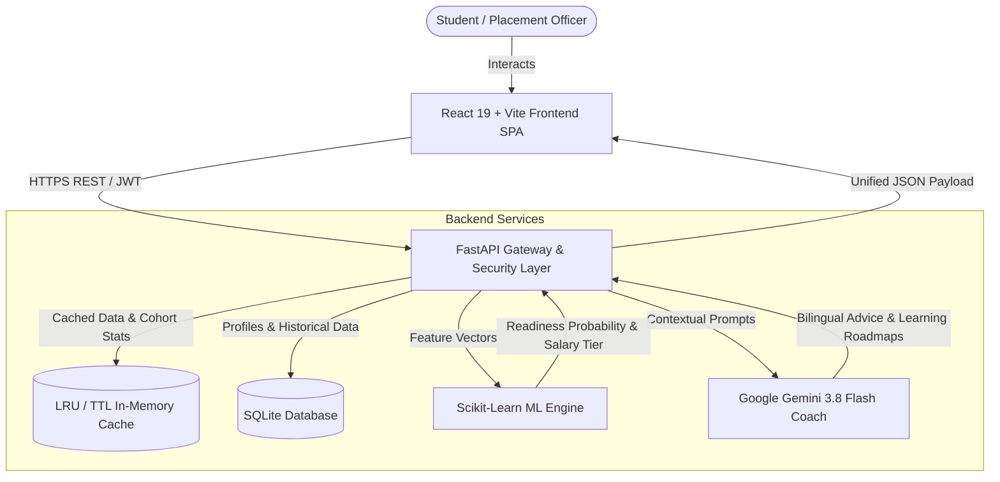

# Pathfinder 2.0

> **An AI career co-pilot that analyzes student skills and projects to predict campus placement odds and generate custom interview roadmaps in seconds.**

[](https://pathfinder-client-fzom.vercel.app)
[](https://pathfinder-backend-klrp.onrender.com/api/health)
[](https://github.com/dileepbommali16-ops/pathfinder)
[](LICENSE)

### 🌟 Experience the Live Platform
👉 **[Launch Pathfinder Live Demo (Vercel)](https://pathfinder-client-fzom.vercel.app)**  
*(Instant guest access available — no signup required to explore features, analytics, and predictions!)*

---

## Problem Statement

Engineering students often struggle to gauge their true placement readiness because academic percentages alone do not reflect modern technical recruitment cutoffs. Furthermore, career guidance in campus placement cells is frequently generic, siloed, and disconnected from historical hiring data and individual skill gaps. Pathfinder bridges this gap by translating academic records, verified technical skills, and project portfolios into actionable placement readiness probabilities, personalized gap-closure roadmaps, and contextual AI-powered mentorship.

---

## Key Features

- **ML Placement Readiness Prediction:** Calibrated Random Forest inference engine providing candidate placement probabilities, salary tier projections, and model confidence scores.
- **Bilingual AI Placement Coach:** Context-aware Google Gemini assistant offering tailored technical interview preparation, resume critiques, and personalized mentorship in English and Telugu.
- **Skill Gap & Career Roadmap Engine:** Automated skill delta analysis evaluating student proficiencies against 14+ target technical roles to construct semester-by-semester learning paths.
- **Interactive Cohort Analytics:** Institutional dashboard visualizing placement trends, branch-wise cutoffs, package distributions, and skill matrices across 970+ historical student records.
- **Curated Architecture Blueprints:** Comprehensive catalog of software and hardware portfolio projects categorized by difficulty level (Small, Medium, Hard).
- **Enterprise Security & Hybrid Auth:** Multi-tenant session management supporting JWT bearer tokens, instant guest demo access, and OAuth 2.0 (Google and GitHub) with IDOR protection.

---

## Tech Stack

| Layer | Technologies |
| :--- | :--- |
| **Frontend** | React 19, TypeScript, Vite, Tailwind CSS v4, Lucide Icons, Recharts |
| **Backend** | Python 3.11, FastAPI, Uvicorn, Pydantic v2 |
| **Database & Cache** | SQLite (WAL mode), In-Memory LRU / TTL Cache |
| **AI & Machine Learning** | Scikit-Learn (Random Forest), Google Gemini 3.8 Flash, OpenRouter (Fallback) |
| **Deployment & DevOps** | Vercel (Frontend SPA), Render (Backend Web Service), GitHub Actions |

---

## Architecture Overview

The platform uses a decoupled, high-performance architecture where each layer has a distinct responsibility:

1. **Presentation Layer (Frontend):** A React 19 SPA hosted on Vercel delivering sub-second interactive dashboards, animated 3D visual feedback, and responsive data charts.
2. **API & Security Gateway (Backend):** A Python 3.11 FastAPI service hosted on Render managing JWT session security, sliding-window rate limiting, and CORS routing.
3. **Data & Persistence Layer (Database):** SQLite configured in WAL (Write-Ahead Logging) mode storing 970+ student cohort records, coupled with an in-memory LRU/TTL caching layer for sub-20ms queries.
4. **Intelligence Layer (ML & AI):** A Scikit-Learn Random Forest model for deterministic, calibrated placement readiness scoring, paired with Google Gemini 3.8 Flash for context-aware bilingual mentorship.



---

## Screenshots

Visual previews of the platform are organized in the [`docs/screenshots/`](docs/screenshots) directory:

- **Dashboard & Readiness Scoring:** `docs/screenshots/dashboard.png`
- **Bilingual AI Placement Coach:** `docs/screenshots/ai_coach.png`
- **Institutional Cohort Analytics:** `docs/screenshots/cohort_analytics.png`
- **Portfolio Architecture Blueprints:** `docs/screenshots/project_blueprints.png`

> *Note: Place your screenshot image files inside [`docs/screenshots/`](docs/screenshots) using the filenames above to preview them directly in GitHub.*

---

## How to Run Locally

Follow these tested steps to run the complete stack on your local machine:

### Prerequisites
- **Node.js** v18+ and **npm**
- **Python** 3.11+

### Step 1: Clone the Repository
```bash
git clone https://github.com/dileepbommali16-ops/pathfinder.git
cd pathfinder
```

### Step 2: Configure Environment Variables
Copy the template configuration file:
```bash
cp .env.example .env
```
Open `.env` and set your Google Gemini API key:
```env
GEMINI_API_KEY=your_gemini_api_key_here
GEMINI_MODEL=gemini-3.8-flash
VITE_API_BASE_URL=http://127.0.0.1:8000
JWT_SECRET=your_local_secret_key_minimum_32_characters
```

### Step 3: Start the Backend Service
```bash
# Create and activate virtual environment (recommended)
python -m venv venv

# Windows:
venv\Scripts\activate
# macOS/Linux:
source venv/bin/activate

# Install dependencies
pip install -r requirements.txt

# Start the FastAPI server
uvicorn backend.main:app --host 127.0.0.1 --port 8000 --reload
```
The backend API will be available at `http://127.0.0.1:8000` (OpenAPI Swagger documentation at `http://127.0.0.1:8000/docs`).

### Step 4: Start the Frontend Client
In a new terminal window:
```bash
# Install frontend packages
npm install

# Launch the development server
npm run dev
```
Open your browser and navigate to `http://localhost:5173`.

---

## Live Demo Links

- **Production Frontend (Vercel):** [https://pathfinder-client-fzom.vercel.app](https://pathfinder-client-fzom.vercel.app)
- **Production API Server (Render):** [https://pathfinder-backend-klrp.onrender.com](https://pathfinder-backend-klrp.onrender.com)
- **API Health Telemetry:** [https://pathfinder-backend-klrp.onrender.com/api/health](https://pathfinder-backend-klrp.onrender.com/api/health)
- **OpenAPI Interactive Documentation:** [https://pathfinder-backend-klrp.onrender.com/docs](https://pathfinder-backend-klrp.onrender.com/docs)

---

## Project Structure

```text
pathfinder/
├── backend/                  # FastAPI backend server
│   ├── main.py               # Application entry point, middleware, and CORS configuration
│   ├── auth.py               # JWT session issuance, password hashing, and authentication
│   ├── ml_engine.py          # Scikit-Learn Random Forest placement prediction engine
│   ├── gemini_coach.py       # Google Gemini bilingual AI career mentor integration
│   ├── analytics_engine.py   # Historical cohort calculations and branch metrics
│   ├── routers/              # Modular FastAPI route handlers (auth, ai, analytics, etc.)
│   └── database/             # SQLite schema migrations, connection pooling, and seed data
├── client/                   # React 19 single-page application
│   ├── src/
│   │   ├── components/       # UI components (dashboard, analytics, AI coach, auth)
│   │   ├── hooks/            # Custom React hooks (auth state, data fetching)
│   │   ├── lib/              # API client, Render cold-start handler, and utilities
│   │   ├── App.tsx           # Primary routing and navigation layout
│   │   └── main.tsx          # Application mount point
│   ├── public/               # Static assets, icons, and logos
│   └── package.json          # Frontend dependency specifications
├── data/                     # Placement datasets (970+ student cohort records)
├── docs/                     # Project documentation and screenshot assets
│   └── screenshots/          # Directory for visual application previews
├── scripts/                  # Automated verification and end-to-end test suites
│   ├── e2e_full_system_pass.py # 35-endpoint full API health and validation test
│   └── test_coach_live.py    # Live Gemini AI connectivity and response test
├── .env.example              # Template environment configuration file
├── render.yaml               # Render web service deployment specification
├── vercel.json               # Vercel SPA routing and build configuration
└── requirements.txt          # Python runtime dependencies
```

---

## 🌐 Full Stack Architecture Breakdown

> **Full Stack = Frontend + Backend + Cloud + Deploy**  
> A complete end-to-end modern web application encompasses the user interface, server-side computation & ML, cloud intelligence services, and automated production deployment pipelines. Here is the exact breakdown of what we used in Pathfinder and the role of each component:

### 1. 🎨 Frontend (Client & UI/UX Layer)
- **React 19 & TypeScript:** Type-safe, component-driven Single Page Application (SPA) offering fast state updates and seamless user experience.
- **Vite 7:** High-speed development server and optimized production build tool with instant Hot Module Replacement (HMR).
- **Tailwind CSS v4:** Modern, performance-focused utility CSS framework providing sleek responsive layouts and dark-mode styling.
- **Lucide React Icons:** Crisp, lightweight SVG iconography across all user dashboards and navigation bars.
- **Radix UI & Framer Motion:** Accessible UI primitives combined with smooth 60fps animations and micro-interactions.
- **Recharts:** Interactive data visualization for student placement readiness probabilities, salary tier percentiles, and cohort analytics.
- **Wouter & TanStack Query:** Lightweight client-side routing paired with asynchronous server-state management and query caching.

### 2. ⚙️ Backend (Server, Business Logic & ML Engine)
- **Python 3.11 & FastAPI:** High-throughput, asynchronous RESTful API framework with automatic OpenAPI/Swagger interactive documentation (`/docs`).
- **Uvicorn & Gunicorn:** Production-grade ASGI server handling asynchronous concurrent client requests.
- **Pydantic v2:** Strict request/response payload validation, schema definition, and serialization.
- **Scikit-Learn (Machine Learning Engine):** Calibrated **Random Forest** classification and regression models trained on 970+ student cohort records to compute placement readiness odds and salary tier predictions.
- **SQLite (WAL Mode) & In-Memory LRU Cache:** Zero-config relational database with Write-Ahead Logging for high-concurrency reads, backed by in-memory LRU/TTL caching for sub-20ms queries.
- **JWT & OAuth 2.0 Security:** Enterprise token-based session management, password hashing, and single sign-on integration via Google and GitHub.
- **ReportLab & PyPDF:** Automated server-side PDF generator constructing downloadable, personalized placement roadmaps and gap-closure reports.

### 3. ☁️ Cloud & AI Services (Intelligence Layer)
- **Google Gemini 3.8 Flash (`google-genai` SDK):** Next-gen generative AI foundation model powering our **Bilingual AI Placement Coach** (capable of contextual career mentorship in English and Telugu).
- **OpenRouter Cloud API:** Cloud LLM fallback provider ensuring 99.9% high availability and fault-tolerant AI responses.
- **Google Cloud Platform (GCP) OAuth Console:** Cloud identity management and API credentials for secure student authentication.

### 4. 🚀 Deploy & DevOps (Hosting & Infrastructure)
- **Vercel (Frontend Edge Hosting):**
  - **Live URL:** [https://pathfinder-client-fzom.vercel.app](https://pathfinder-client-fzom.vercel.app)
  - Edge CDN deployment delivering global low-latency page loads, automatic Git branch previews, and single-page routing rewrites (`vercel.json`).
- **Render (Backend Cloud Web Service):**
  - **Live URL:** [https://pathfinder-backend-klrp.onrender.com](https://pathfinder-backend-klrp.onrender.com)
  - Cloud Linux container service executing FastAPI with automated Git deployments via `render.yaml` and live health-check telemetry (`/api/health`).
- **GitHub & GitHub Actions:** Source control, automated testing workflows, and project lifecycle management.

---

## License & Credits

- **License:** Distributed under the [MIT License](LICENSE).
- **Author:** Developed by **Dileep Bommali** ([@dileepbommali16-ops](https://github.com/dileepbommali16-ops)).
- **Acknowledgments:** Built for hackathon evaluation utilizing Google Gemini Generative AI and modern open-source full-stack tooling.
