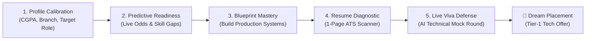

# Pathfinder 2.0 · Autonomous AI Career Operating System & Placement Intelligence

> **India's premier AI-powered career operating system for engineering candidates. Benchmarks student profiles against 972 verified campus recruitment outcomes, predicts placement odds with 88% ML precision, tutors 23 production-grade flagship architectures, and prepares engineers for Tier-1 recruitment filters with DAS — our autonomous 3D cybernetic voice co-pilot.**

[](https://pathfinder-client-fzom.vercel.app/?demo=1)
[](https://pathfinder-client-fzom.vercel.app/?demo=1)
[](https://pathfinder-client-fzom.vercel.app/?demo=1)
[](https://pathfinder-client-fzom.vercel.app/?demo=1)
[](https://pathfinder-client-fzom.vercel.app/?demo=1)
[](LICENSE)

---

### 🌟 Experience the Live Platform
👉 **[Launch Pathfinder 2.0 Live Demo](https://pathfinder-client-fzom.vercel.app/?demo=1)**  
*(⚡ Instant 1-Click Access — Anyone can explore immediately with zero setup!)*

---

## 📸 Live Interface Showcase (Desktop & Mobile)

| Desktop: Glass Cards Mode (1440px) | Desktop: Focus on DAS 3D Mode (1440px) |
| :---: | :---: |
|  |  |

| Mobile: Glass Cards Mode (375px) | Mobile: Focus on DAS 3D Mode (375px) |
| :---: | :---: |
|  |  |

---

## 🎯 The Problem: Why 80%+ of Engineering Students Fail Campus Placements

Every year, millions of engineering graduates enter the campus placement season, yet **over 80% struggle to secure high-paying Tier-1 offers**. The root causes are systemic:

1. **The ATS Screening Black Hole**:
   Over **75% of student resumes are rejected automatically** by Applicant Tracking Systems (ATS) within seconds. Students unknowingly submit poor formats, generic buzzwords, and vague descriptions that fail recruiter screening algorithms before a human ever reads them.

2. **The "Toy Project" Trap**:
   Most student portfolios feature trivial, copy-pasted tutorial projects (basic To-Do apps, simple e-commerce clones, or generic calculators). When interviewers ask about system architecture, concurrency, caching, failovers, or database indexing, candidates crumble because they have never touched production-grade systems.

3. **Technical Viva & Architecture Defense Gaps**:
   Memorizing Data Structures and Algorithms (DSA) is no longer enough. Modern hiring bars demand system design depth and STAR-format technical defense. Students lack a safe environment to practice tough technical viva rounds and articulate their architectural decisions.

4. **Blind Applications Without Objective Benchmarking**:
   Students apply to companies blindly without knowing their realistic placement odds, competitive tier standing, or branch-specific cutoffs. They have no data-backed feedback loop to know what to fix before placement season arrives.

---

## 💡 What Pathfinder 2.0 Does & How It Solves the Crisis

**Pathfinder 2.0 is the complete AI Career Operating System designed to turn any engineering student into a high-caliber, interview-ready candidate.**

It unifies **predictive data science**, **production-grade engineering blueprints**, **interactive AI viva coaching**, and an **autonomous 3D cybernetic voice co-pilot** into one cohesive platform:

```
┌────────────────────────────────────────────────────────────────────────────────────────┐
│                   PATHFINDER 2.0 · STUDENT CAREER OPERATING SYSTEM                     │
├────────────────────────────────────────────────────────────────────────────────────────┤
│                                                                                        │
│   🎯 PREDICTIVE INTELLIGENCE       📊 COHORT BENCHMARKING       📁 23 BLUEPRINTS       │
│   88% ML placement odds & CTC      972 verified campus records   Real-world production │
│   calibrated against real data.    showing realistic cutoffs.    system architectures. │
│                                                                                        │
│   🎙️ AI MOCK INTERVIEW STUDIO     📄 1-PAGE ATS RESUME STUDIO  🤖 DAS 3D VOICE AGENT  │
│   Live technical & behavioral      Google X-Y-Z formula audit   Hands-free autonomous  │
│   viva defense with feedback.      with zero ATS drop-off.      site control & copilot.│
│                                                                                        │
└────────────────────────────────────────────────────────────────────────────────────────┘
```

---

## 🚀 Why Engineering Students MUST Use Pathfinder 2.0

### 1. 🎯 Know Your Placement Odds Before Facing Recruiters
- Uses a **Random Forest ML model trained on 972 verified campus recruitment outcomes** across CSE, ECE, EEE, Mechanical, Civil, and IT.
- Calculates an objective **Placement Probability Score (e.g., 91.9%)** and identifies your exact competitive tier.
- Pinpoints your critical bottlenecks (coding speed, CGPA filter risks, system design depth) so you can fix them weeks before campus drives start.

### 2. 🤖 DAS 3D Voice Co-Pilot with Full Autonomous Control
- Meet **DAS (Digital Architecture Sentinel)** — a futuristic 3D cybernetic AI agent rendered with real-time WebGL facial mesh, natural lip-sync, and expressive eye tracking.
- **Hands-Free Autonomous Website Control**: Speak or type naturally in English, Telugu, or Hindi (e.g., *"Blueprints loki velli oka chinna project ivvu"* or *"Open mock interview"*), and DAS will **autonomously switch tabs, scroll to the exact component, and spotlight the blueprint card with a pulsing glow**.
- Dual input modes: Speak hands-free via microphone or type directly into the compact docked chat bar when in a quiet library or study room.

### 3. 📁 23 Production-Grade Flagship Project Blueprints
- Replaces generic tutorial clones with **23 industry-grade production architectures** that recruiters respect:
  - **Enterprise RAG Knowledge Engines** (Multi-agent regulatory research, hybrid Qdrant vector retrieval, autonomous verification).
  - **Distributed Asynchronous Job Queues** (Token-bucket rate limiters, Redis Streams, PostgreSQL locks).
  - **Real-Time Collaborative Canvases** (WebSockets, CRDT conflict-free replication).
  - **Industrial IoT Sensor Telemetry** (STM32 LoRa nodes, edge anomaly detection).
  - **City-Wide Computer Vision Systems** (DeepSORT tracking, license plate OCR, edge acceleration).
- Each blueprint includes **complete architectural diagrams**, **tech stacks**, **core failure modes**, and **Google X-Y-Z bullet points ready for your resume**.

### 4. 🎙️ Live AI Mock Interview Studio & STAR Defense
- Step into an interactive technical viva tailored directly to your target role (Software Development Engineer, AI Engineer, Full-Stack Developer, Data Engineer).
- DAS challenges you on architecture trade-offs: *"Why did you pick Redis Streams over Kafka?"*, *"How does your rate limiter handle bursts?"*, *"What happens when the primary database fails?"*.
- Real-time scoring on technical accuracy, clarity, and architectural maturity.

### 5. 📄 1-Page ATS Resume Studio
- Automated diagnostic scanner built strictly on the **Google X-Y-Z achievement formula** (*"Accomplished [X], as measured by [Y], by doing [Z]"*).
- Audits your resume for ATS formatting compliance, keyword relevance, and quantifiability.
- Generates a clean, single-page, recruiter-approved resume guaranteed to pass ATS filters.

### 6. 📊 Transparent Cohort Analytics (972 Campus Records)
- Gain unrestricted access to real campus hiring statistics:
  - Branch-wise placement percentages and historical salary packages (from 4.5 LPA to 24 LPA).
  - Tier-1 vs. Tier-2 company selection cutoffs and hiring patterns.
  - Objective peer benchmarking to measure where you stand in your graduating class.

---

## 👥 Who Is Pathfinder 2.0 For?

### 🎓 Engineering Students (B.Tech / M.Tech / MCA)
- **Freshmen & Sophomores**: Discover the exact skills high-paying companies demand and build the right projects early.
- **Pre-Final & Final Year Students**: Diagnose placement readiness, upgrade resume projects to production grade, practice mock interviews, and crack dream campus offers.

### 🏫 College Placement Cells & Training Officers (TPOs)
- **Institutional Placement Governance**: Track real-time placement readiness across all engineering departments.
- **Skill-Gap Diagnostics**: Identify batch-wide weaknesses (e.g., system design or coding speed) and organize targeted bridge bootcamps.
- **NAAC 5.2 Compliance**: Streamline student placement data tracking for regulatory accreditation.

### 💼 Tech Recruiters & Hiring Managers
- **Verified Candidate Competence**: Review student projects backed by real architectural depth rather than copied tutorials.
- **Transparent Evaluation**: Benchmark candidate readiness scores and verify their technical defense capability before scheduling on-site interviews.

---

## 🧭 The Pathfinder Student Journey


```mermaid
flowchart LR
    A["1. Profile Calibration<br/>(CGPA, Branch, Target Role)"] --> B["2. Predictive Readiness<br/>(Live Odds & Skill Gaps)"]
    B --> C["3. Blueprint Mastery<br/>(Build Production Systems)"]
    C --> D["4. Resume Diagnostic<br/>(1-Page ATS Scanner)"]
    D --> E["5. Live Viva Defense<br/>(AI Technical Mock Round)"]
    E --> F["🎯 Dream Placement<br/>(Tier-1 Tech Offer)"]
```

1. **Calibrate**: Input your current academic details, branch, target role, and self-assessed coding skills.
2. **Predict**: Review your real-time placement probability and identify your critical bottlenecks.
3. **Build**: Upgrade your GitHub with 2-3 production blueprints from our curated catalog of 23 architectures.
4. **Optimize**: Format your resume with the 1-Page ATS Scanner using quantified impact bullets.
5. **Defend**: Practice viva rounds with DAS until your technical and behavioral articulation is second nature.
6. **Conquer**: Walk into campus interviews with unshakable confidence and land your dream offer.

---

## ⚡ Core Capabilities Matrix

| Platform Module | What It Delivers | Concrete Student Outcome |
| :--- | :--- | :--- |
| **Executive Readiness Dashboard** | Transparent multi-vector placement score & eligibility radar. | Know your real chances before applying blindly. |
| **DAS 3D Autonomous Co-Pilot** | Real-time 3D cybernetic voice agent with hands-free site control. | Learn, practice, and navigate conversationally. |
| **Project Blueprint Catalog** | 23 production architectures with deep system design and code guides. | Stand out in interviews with genuine production depth. |
| **Technical Defense Console** | Viva simulator challenging students on architecture and trade-offs. | Never get blindsided during system design interviews. |
| **ATS Resume Studio** | 1-page single-column builder with Google X-Y-Z audit engine. | Pass automated recruiter resume screeners every time. |
| **Cohort Placement Analytics** | Granular data across 972 student records filtered by branch & CTC. | Real-world salary benchmarks and hiring cutoff transparency. |

---

## 👑 Product Architect & Founder

Pathfinder 2.0 was conceived, designed, and architected by:

**Dileep Bommali**  
*Lead Architect, Founder & Full-Stack AI Engineer*  
- **Email**: [dileepbommali16@gmail.com](mailto:dileepbommali16@gmail.com)  
- **Platform**: [Pathfinder 2.0 Live Platform](https://pathfinder-client-fzom.vercel.app/?demo=1)

---

## 📜 License

This project is open-source under the [MIT License](LICENSE).
